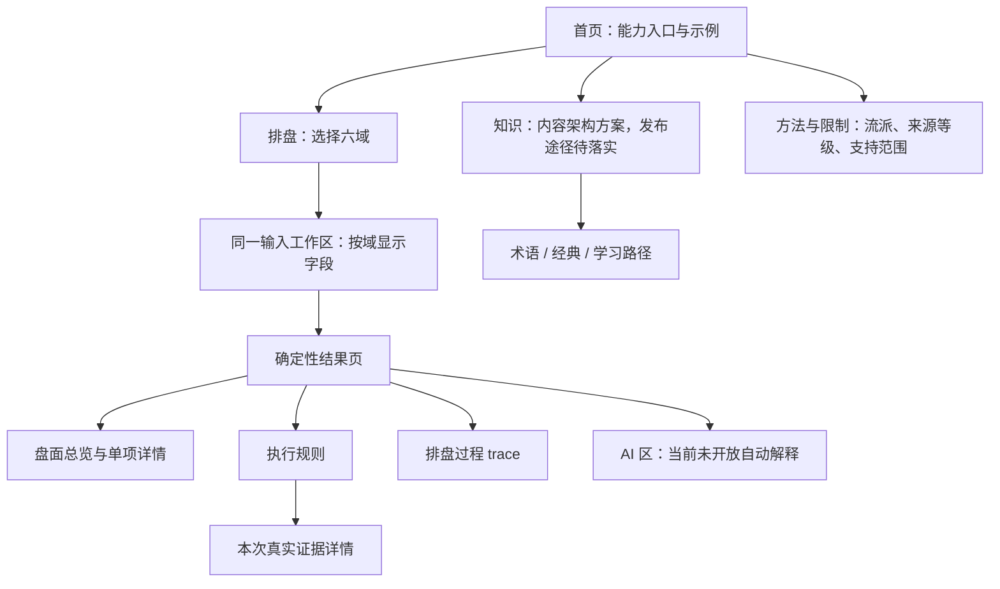

# Phase 5 信息架构与页面原型说明

这是供讨论的文档原型，不是已开发的网站。先阅读 [Benchmark](BENCHMARK.md)；参考材料的确认程度与固定版本见 [来源记录](SOURCES.md)。本阶段没有 HTML/React/Vue 原型、页面代码、竞品素材或新后端接口。

目标：让用户先取得可复核的确定性盘面，再按需理解规则和依据。界面同时回答“盘是什么”“为什么这样排”“原文支持到哪一步”“哪些尚不确定”。AI 解释的文字不能覆盖、补算或纠正计算引擎盘面。

## 1. 能力边界先于菜单

以下基于实际 `GET /api/v1/capabilities` 和六个 `explain=false` 请求核对，而不是旧 README 的广泛知识目录。来源：[T-01](SOURCES.md#t-01)。

| 内容 | 当前可用 | 页面允许承诺 | 不能暗示已具备 |
| --- | --- | --- | --- |
| 六爻 | 时刻或显式干支 + 六爻值 → 本变卦、纳甲、六亲、世应、六神、旬空/月破和动爻 | 结构排盘、逐爻标记与相应依据 | 自动随机摇卦、综合旺衰、取用吉凶、应期断语 |
| 奇门 | 精确时刻 → 节气、遁局、九宫、值符值使、星门神 | 当前单一转盘约定的盘面 | 多流派切换、置闰/超接/飞盘、终身盘与吉凶专题 |
| 六壬 | 时刻或显式节气/日干支/时支 → 月将、天地盘、四课、九宗门三传 | 取传结构及选法过程 | 天将、贵人全盘、神煞吉凶与现实预测 |
| 紫微 | 时刻 + 明确春节年界，或非闰月农历资料 → 命身宫、局、十二宫、主辅星与具名软件四化 | 基本安星结构；四化保留 D 与疑文提示 | 闰月、真太阳时、大限流年、亮度/庙旺、跨派四化结论 |
| 风水 | degrees → 二十四山、卦/山各自五行、对宫 | 二十四山定位与角度说明 | 生产元运、玄空飞星、八宅吉凶、房屋合参或手机传感器精准测向 |
| 周易 | 自下而上六位爻结构 + 动爻 → 本/错/综/互/变 | 卦结构与相关原文 | 时间/数字起卦、具体吉凶预测；不得混成完整梅花算法 |
| 八字 | 已有部分 Canonical 知识和检索资料；不在 execute 六域中 | 知识栏目可纳入已审八字资料，需另落实公开内容发布途径 | 新的八字排盘入口或跨域合盘；这会超出本阶段范围 |
| AI | 版本化解释与结构/引用校验已实现；真实模型校准未完成 | 内部评测或人工复核后的解释状态展示 | 六域 AI 自动公开解释已经合格 |
| 古籍/术语/RAG | Canonical、reviewed RAG、EvidenceResolver 已有；execute 中可返回证据 | 结果内证据详情直接用 response.evidence | 公众古籍列表/全文搜索/术语独立 API 已存在 |

公共历法把带时区时刻转到 Asia/Shanghai，时间路径支持 1900–2099；默认午夜换日。不存在真太阳时校正接口。紫微时间输入另要求 `year_boundary=lunar-new-year`，拒绝闰月；其余域不能任意套用这个年界选项。前端只编码日期/爻输入，不自己算干支、节气或盘面。

`rule_matches.kind=executed_calculation` 是执行过的计算步骤，不能改名“已验证吉凶断语”。例如六爻月破标记正确，不等于已经执行所有旺衰与应期判断。

## 2. 全站信息架构

主导航采用 **排盘、知识、方法与限制**，品牌入口返回首页。桌面域选择放在排盘工作区；手机主导航不挤入六个域名。知识内可按六域及已有基础/八字内容分类，不增加第七个执行域。



| 拟议页面地址 | 任务 | 当前数据 / 状态 |
| --- | --- | --- |
| `/` | 选能力或进入示例 | 六域 capabilities；示例真正执行，不拼造盘面 |
| `/charts/new?domain=liuyao` 等 | 按域输入与确认约定 | 同一工作区，共用请求层；不是新增六套 API |
| `/charts/result` | 查看本次结果与证据 | 当前请求的内存结果；暂没有 `/results/:id` 持久化接口 |
| 结果页 `#rules/#trace/#ai` | 同盘不同视图 | 当前 payload 的相应字段，不新开盘 |
| 结果页内证据详情 | 核对引用并返回原位置 | 按 evidence 字典键在当前 response 中查找，不调用不存在的 `/evidence/:id` |
| `/knowledge`、`/knowledge/terms`、`/knowledge/classics` | 浏览、释义与典籍阅读 | 信息架构预留；内容已有，公众目录/搜索/发布尚待设计，没有本次实现承诺 |
| `/method` | 理解 variant、范围、来源与未核问题 | capabilities 的 scope/limitations + 经审核的方法文档 |

以上是拟议网站路由，不是当前后端已提供的 endpoint。后端目前只有 health、capabilities、execute 及 OpenAPI 文档等既有接口。

不设置会员、付费、SEO 专题、人物档案、服务器历史、公开分享链接或“AI 顾问”一级导航。来源：[MY-01](SOURCES.md#my-01)、[C-01](SOURCES.md#c-01) 的任务/模块入口；将数量收敛和方法栏目独立是本项目原创取舍。

## 3. P01 首页原型

```text
[原创站名]                    排盘 | 知识 | 方法与限制

选择要查看的盘面
六爻：逐爻装卦          奇门：时家转盘
六壬：四课三传          紫微：基本安星
风水：二十四山定位      周易：卦结构
每项：一句用途 + 当前范围 + [开始] [查看方法]

[运行公开示例]          来源与计算约定说明
AI 自动解释尚未开放；已生成盘面可独立查看规则与依据
```

- 首屏优先提供真实能力入口，不要求先描述人生问题；首页不把聊天框当排盘入口。参考命语任务切换 [MY-01](SOURCES.md#my-01)，调整原因是现 execute 没有自然语言选域或问题字段。
- 六域卡片由 capabilities 驱动；风水卡直接说明“二十四山定位”，紫微说明“基本安星”，不笼统写“完整专业预测”。这是本库范围约束 [T-01](SOURCES.md#t-01)。
- 示例来自公开 Golden Cases 或 capabilities.example，调用同一 execute。没有真人资料、随机假盘或为了视觉预填的命中规则。
- 手机使用单列或两列文字任务卡；不用只靠卦符识别入口。参考平台模块矩阵 [C-01](SOURCES.md#c-01) 的入口组织，不沿用印章、品牌字形或低对比文字。
- 知识发布方式未落实时，原型里的知识入口只表示方案；实际未来上线应隐藏或明确未开放，不连接不存在的 API。

## 4. P02 输入工作区原型

```text
排盘 > 六爻
[切换领域]  当前约定：京房八宫 v1 [查看口径]

1 输入六个爻值：从初爻到上爻
  初爻 [6老阴 / 7少阳 / 8少阴 / 9老阳]
  ……逐次到上爻；预览保留“初爻在下”的方位
2 起卦时间 [日期] [时间] [时区偏移]
  [高级：使用显式干支资料]（与时间输入二选一）
3 确认：六爻值、时刻/手动资料、计算约定

[生成盘面]             此步骤不请求 AI
```

每域只有必要字段；共享时间控件、校验呈现和提交操作，盘面字段由各域定义。参考 MingPan 输入契约 [M-01](SOURCES.md#m-01)、命语条件字段 [MY-02](SOURCES.md#my-02)、平台共享表单 [C-02](SOURCES.md#c-02)。

| 域 | 普通输入 | 高级输入 / 口径 | 重点防错 |
| --- | --- | --- | --- |
| 六爻 | 六值 `yao_values` + 带时区 `value` | `day_ganzhi` + `month_branch` 替代时间 | 数组从初爻到上爻；6/9 动，7/8 静；不模拟随机摇卦 |
| 奇门 | 带时区 `value` | 展示固定节气/午夜换日/寄宫规则，无其它盘法控件 | 不出现置闰、飞盘等不可用选项 |
| 六壬 | 带时区 `value` | `solar_term` + `day_ganzhi` + `hour_branch` 替代时间 | 不混填派生字段；涉害 unresolved 错误不自选一个初传 |
| 紫微 | 带时区 `value`，明确春节年界 | `year_ganzhi`、`lunar_month`、`lunar_day`、`hour_branch` 显式非闰月路径 | 无闰月及真太阳时功能；不把普通公历输入先在浏览器转农历 |
| 风水 | 数值 `degrees` | 仅解释角度口径；production 不收年份/epoch | 0°北、顺时针；南上/北上图示切换只改变显示，不改变角度；不擅自把“向”反算为“坐” |
| 周易 | 六位阴阳选择，编码为 bottom-up `bits`；可选 `changing_lines` | 文本输入六位 bits 仅作为快捷编码 | 初爻为 1；不混淆显示从上到下与数组从下到上 |

用户看见字段旁的具体口径，技术标识 variant 可在详情中复制；当前每域仅一个有效 variant，用“当前支持”显示，无假多选下拉。未来 capabilities 实际返回多个 variant 才启用切换；切换会清空旧结果/解释，输入是否可复用要重新校验。来源：[T-01](SOURCES.md#t-01)，不是照搬竞品流派按钮。

提交为 `{domain, variant, input, explain:false, mode:"production"}`。没有额外 top-level 字段；自然语言问题、姓名、性别、出生地和模型 key 不混进 input。日期/时区缺失时标注该字段；API 422 映射到当前表单并保留输入，拒绝 unsupported variant，不替用户换派。数据范围以 API 校验为准。

手机表单按步骤纵向展开；键盘打开时主按钮可见但不盖住输入，返回保留尚未提交草稿。颜色之外用文字标明必填/错误/动爻。最低 44px 触控目标、键盘可操作和大字体为本项目验收目标，不能宣称参考产品全部达到。

## 5. P03 通用结果页原型

```text
六爻结果             [修改输入] [新建]
输入摘要 | 时区/换日 | 当前 variant | production
范围与限制：结构排盘；不计算完整旺衰/吉凶

[盘面] [执行规则] [原典依据] [排盘过程] [AI解释]

主区：专业盘面                    桌面侧区：选中爻/宫详情
点击字段 → 相关执行规则 → 本次 evidence → 返回原位置

移动端：盘面仍在当前页；单项详情/原典另开可返回的详情层
AI 区始终保留“未开放 / 需人工复核 / 失败”的状态
```

信息顺序固定：**输入与约定 → 限制提示 → 盘面 → 执行规则 → 原典/实现依据 → 推演 → AI 解释**。用户可用 tabs/锚点快速到达，但限制提示不藏在最后。若 research，页面顶部持续保留研究提示，不用一次性 toast。

| 层级 | 数据 | 用户应理解 | 参考 |
| --- | --- | --- | --- |
| 输入摘要 | 提交资料、calendar、variant/mode | 这次算的是哪一盘、用哪种约定 | 命语时间口径 [MY-03](SOURCES.md#my-03)；本库 API |
| 范围条 | warnings/limitations | 有结果仍可能存在范围限制 | 本库 scope/未核冲突；命语能力说明 [MY-03](SOURCES.md#my-03) |
| 盘面 | chart | 确定性计算事实 | 命语/平台图表、MingPan 文本 [MY-03](SOURCES.md#my-03) [C-02](SOURCES.md#c-02) [M-02](SOURCES.md#m-02) |
| 执行规则 | rule_matches | 哪些计算步骤实际执行，而非所有知识规则 | 本库；不是竞品截图的“吉凶结论” |
| 原典依据 | evidence | 支持哪些步骤、来源等级与定位 | 本库 EvidenceResolver；释义入口借鉴 [MY-05](SOURCES.md#my-05) |
| 排盘过程 | trace | 每一步输入、输出和依据 | 本库新增可审计表达；不假称参考产品同样提供 |
| AI | explanation/status/quality fields | 经校验的解释及仍需复核之处 | 命语助手分区、平台次级 AI [MY-03](SOURCES.md#my-03) [C-04](SOURCES.md#c-04) |

规则详情至少显示 rule_id、variant、执行类型、facts 和 evidence_ids。只在 payload 中有明确位置/字段绑定时定位到宫爻；未知映射则展示通用计算步骤，不猜“这个规则属于哪个宫”。

正常结果是 HTTP 200；`explanation_status=failed` 也可能 HTTP 200，不能只看 HTTP 判定 AI 成功。输入错误 422、runtime 不可用 503 各自处理；503 不展示上一次缓存盘为本次成功结果。

结果只在当前内存会话中，不能伪装为已保存盘档。刷新后若结果丢失，提供重新输入/重新执行；没有把出生资料放到分享 URL 的设计。未来若增加显式保存、导出或持久化，需要另立数据处理与后端需求，本次不实现。

## 6. P04 六域盘面原型

### 六爻

```text
日期/日月资料 | 本卦、所属宫 | 变卦
上爻：六神  六亲 纳甲 [本爻] 动静/世应 [变爻] 变纳甲  空/月破
……
初爻：同一行保留本爻与变爻，不因窄屏拆成两个远离的整卦
点选三爻 → 三爻事实、对应 trace、规则、引用
```

使用 `lines.position` 明确排序；画面上爻在上，录入序列初爻在先，不能直接反转数据后失去爻位标识。世应取 `palace.shi/ying`；变爻六亲使用 `changed_relative_to_original_palace`，文字说明参照原宫。移动初始保留爻位/本变/世应/动静，纳甲、六亲、六神及空破在该爻详情完整显示；标记不能只有红绿颜色。

参考命语本变逐爻表 [MY-03](SOURCES.md#my-03)、MingPan 逐行 renderer [M-02](SOURCES.md#m-02)、平台梯形表 [C-02](SOURCES.md#c-02)。采用其对齐关系，不抄字符样式、颜色或断语。

### 奇门

九宫保持 3×3。固定同一种方位口径：若南在上，宫序为 `4/9/2；3/5/7；8/1/6`，显示南/北方位说明；不能按数值 1–9 顺排成图。全盘头部先显示时刻、节气、阴阳遁、元、局、值符、值使。

每宫初始只显示宫名及星/门/神/天盘地盘干的核心信息，完整内容在点选详情中分列。中宫寄法来自 `center_star_policy`；`star_positions` 中天禽与天芮同宫时保留两个具名星，不把中宫包装成第九个外宫。没有的吉凶/格局不由前端补写。

参考命语点选宫与平台九宫分区 [MY-03](SOURCES.md#my-03) [C-02](SOURCES.md#c-02)；全盘头部字段也见 MingPan renderer [M-02](SOURCES.md#m-02)。寄宫与 variant 的准确表达来自本库。

### 六壬

```text
月将、日干支/时支、取传法
[天地盘：十二支固定环序；文字替代为地支→天盘支表]
[一课] [二课] [三课] [四课]：每课上神/下项保持一对
初传 → 中传 → 末传
[为何采用比用/涉害等] → trace.inputs / selection / evidence
```

直接用 `sky_plate`、`four_lessons`、`transmissions`、`method`、`selection`。手机四课允许 2×2，但课序和上下项始终标明；三传从初到末不可因响应式逆序。环盘是排版映射，不新增天将/神煞数据。遇 unresolved 涉害 tie 的 422，保留输入并提示当前约定未能裁定，不让 AI 选传。

参考命语四课/三传矩阵、MingPan 的专业文本顺序 [MY-03](SOURCES.md#my-03) [M-02](SOURCES.md#m-02)。平台当前没有六壬入口，不用它作这一页的参考。

### 紫微

十二宫置于 4×4 外环，中间 2×2 区显示出生资料、命身宫、五行局及当前安星约定。宫位按照后端 palaces 与固定地支位置映射，不按“命、兄弟、夫妻”的字典枚举顺序随便塞入格子。宫内先主星，辅星放次层；命宫、身宫使用图形加文字。

点选宫位后显示主辅星与本盘四化关联；四化名到星/宫的定位只用当前返回映射，必须显示 `mutagen_variant` 和 `mutagen_evidence`。壬年府/辅疑文与 D 表提醒常驻四化区，不能藏到“关于”。没有大限、流年、庙旺/亮度视图或假流派切换按钮。

参考命语十二宫/宫位详情与平台星宫布局 [MY-03](SOURCES.md#my-03) [C-02](SOURCES.md#c-02)；只取空间组织，不抄连线视觉，不引入其飞化计算或合参判断。

### 风水

主标题“二十四山定位”。先显示输入角度、归一化角度、所在山、对宫；次区分别显示山五行与卦五行，字段不同不能合并成一个“五行”。可用原创二十四等分环形示意配数值表，提供文字替代；选中山的位置来自 chart，不在浏览器重算分区。

例如已有 API 示例 `degrees=37.5` 返回艮/对宫坤，属于确定性定位。说明半开扇区边界；可点击“查看区间约定”，但不自动认为测量精度足够或连手机罗盘实时测向。

借鉴平台方位可视化与命语住宅分层的文档模式 [C-02](SOURCES.md#c-02) [MY-03](SOURCES.md#my-03)，**不继承八宅/玄空能力**。生产页不显示 year→元运控件；research 的显式 year/epoch 数学例子只列在方法说明，标注未裁定纪元和交运边界，不作为公众房屋结论。

### 周易

本卦为主；错卦、综卦、互卦、变卦为四张关系卡。各卡展示名称、六爻与上下卦；点选关系显示对应 trace 与原典。动爻显示编号，六位编码自下而上。

文字替代来自同一 chart；乾坤结构互卦和“乾坤无互”的解释例外分开显示，以 `nuclear_scope` 为准，不改 chart。参考 MingPan 的结构化/可读输出原则 [M-01](SOURCES.md#m-01)，布局与语义来自本库周易能力，不能归因于未观察的竞品页面。

## 7. P05 原典、术语与学习原型

**结果内依据详情可直接用现有返回；全站知识浏览是内容架构预留，不是已完成的 HTTP 能力。** 来源：[T-01](SOURCES.md#t-01)。

```text
原典依据  [返回原爻/宫/规则]
《书名》 > 章节 > locator         C：单一可追溯电子来源
原文：只显示本次审核并返回的 original_text
支持范围：该证据的 rule_id / role / variant
当前引用的限制与不同约定
[来源链接] [展开版本：commit / sha256 / source_id]
相关规则（限当前 payload 的明确绑定）
```

- evidence dictionary key 是本次证据 ID；book/chapter/locator、commit、sha256 和 source_url 均来自真实字段。模型生成的书名/链接不能填补缺项。
- 引用精读先给原文，再给审核的现代释义；AI 的综合解释单列。若来源只有 D，实现依据就显示“实现约定”，不能改称“原典证实”。
- C＝单一可追溯来源；D＝现代实现或待复核。A/B 的独立版本标准见方法页，当前实际数量为 0；不显示虚假的 A/B 徽章、星级或“权威率”。
- 某些 production 计算有明确范围的 D 软件辅助证据，仍可展示计算事实及限制；D 不支持包装成确定古典断语。research-only 纪元不进入公众确定结论。
- quarantine 整书不进入公众阅读或全文搜索；当前 Canonical 中可用的已审短引不等于整本正文可发布。许可、版本与审核范围须在未来知识发布途径中保留。

术语详情参考命语上下文释义 [MY-05](SOURCES.md#my-05)：简明定义、当前盘字段位置、相关规则、当前 evidence、相近术语。没有已审核定义时显示“尚无已核释义”，不调用模型即兴补词条。关闭后恢复原位置和键盘焦点。

知识中心参考平台目录/精读 [C-03](SOURCES.md#c-03)，拟分“术语”“经典”“学习路径”。经典目录分别标注“可读正文/已审选段/仅书目”；学习路径从干支/五行/八卦 → 当前域输入与盘面 → 公开 Golden Case 的推演/引用示例，不扩充书库或生成未经审核的课程。

当前没有独立知识搜索 API。将来可另设计审核过的静态内容发布或服务接口，现阶段原型只描述布局，不暴露内部 build 路径、quarantine 文件或任意整书。

## 8. P06 AI 解释与状态原型

当前全站默认 explain=false。真实模型回归和语义复核未完成，公众不提供“一键自动解释”。可以设计内部评测/人工复核态，但不能因解释 HTTP 成功就开放自动发布。来源：[T-01](SOURCES.md#t-01)。

未来在批准的范围内按需解释：以相同 domain/variant/input/mode 再 POST execute、explain=true。请求会再次走确定性引擎；前端保留原盘，若返回计算内容或来源与当前快照不一致，提示重新确认新结果，不能用模型 claim 补丁修改盘。RAG 由服务端检索；无需新建前端 RAG 管线。

| 状态 | 可见内容与行为 |
| --- | --- |
| 当前未开放 | 显示“自动解释尚未通过真实评测”，盘面/规则/依据照常可用 |
| disabled | 未请求模型，允许查看方法和证据；没有伪造的占位解释 |
| 请求中 | 保留原盘及原有依据，显示解释状态；不展示未校验流式 token，不承诺服务端取消接口 |
| failed | 保留原盘，显示解释暂不可用；若在允许范围可重试解释，绝不要求用户重排或补密钥 |
| succeeded + requires_semantic_review | 五分类解释及“待语义复核”，不能隐藏 `semantic_review_required` |
| degraded_requires_review | 降级提示、限制/争议与条件性文字；不是完整可靠的结论 |

解释分类按现有 sections/claims 显示：

1. 确定性盘面事实：只呈现已计算字段；computed 不是“预测确定”。
2. 规则命中：只含当前执行规则，不泛列知识库的所有规则。
3. 古籍依据：真实 evidence_id/source_ref，引用点击到 P05。
4. 综合解释：C 来源使用条件性表述；不把综合判断写进盘面。
5. 不确定与流派争议：D/research 内容、未核冲突、limitations，始终可见。

按模型响应中的 kind/sections 索引呈现，而不是前端从 prose 再猜分类。未知 citation 已由后端拒绝；前端仍只允许指向本次 evidence 的真实 ID，未知 ID 不产生外链。`automatic_release_allowed=false` 必须保留其实际意义；不能用新 UI 隐藏当前未取得上线资格这一事实。

参考命语盘面/助手分开 [MY-03](SOURCES.md#my-03)、平台按需 AI/错误保留 [C-04](SOURCES.md#c-04)、元亨独立插件的结果后解释顺序 [S-02](SOURCES.md#s-02)。不采用其用户密钥、自由追问、自动启动、模型补算或直接 SSE 展示。现 API 不接收 question，也没有 conversation/session endpoint；多轮对话不是本期页面原型的可调用能力。

## 9. 设计决策归因

| 决策 | 参考谁 | 为什么与现有能力相容 |
| --- | --- | --- |
| D01：按任务选域、域深链接、统一工作区 | 命语首页/工作区、平台模块入口；元亨第三方页面清单 | 六域共用 execute，用户不必面对接口或六套页面逻辑 |
| D02：最少字段 + 高级资料路径 | MingPan API、命语条件表单、平台共享表单 | 精确映射每域 input，拒绝混填派生值 |
| D03：图形总览 + 单项详情 | 命语点宫/十二宫、平台盘面组件 | 只渲染 chart，详情展开不引入新计算 |
| D04：本变卦逐爻对齐 | 命语六爻、MingPan renderer、平台梯形盘 | 保护 lines.position/世应/动变对应关系 |
| D05：奇门九宫与六壬四课/三传保持空间/顺序 | 命语传统盘、MingPan renderer；奇门另参考平台 | 盘面结果已具备，寄宮/选法由后端给出 |
| D06：手机详情分层、保留返回定位 | 命语响应式代码与公开截图 | 盘面不会被长解释或大弹层替代；本站 44px/焦点目标是原创验收标准 |
| D07：就地术语释义 | 命语术语组件 | 释义不离开当前上下文；只用已审内容，不沿用未知词 fallback |
| D08：知识目录与原典阅读分开 | 平台知识页 | 适合 Canonical 内容组织；明确公开发布接口未实现 |
| D09：图形的语义文本替代 | MingPan data/text 原则 | 同一 chart 多种表达，避免复制计算和宽表格成为手机主视图 |
| D10：按需解释、失败保留盘面 | 平台 AI 面板、命语助手分区、元亨独立插件 | 对应 explain=false/true 与失败降级；不改变后端响应协议 |
| D11：variant、证据等级、研究范围与 trace 可查 | 本仓库引擎/Resolver/Phase 4 契约 | 本项目原创审计层；不伪称竞品已做同等验证 |
| D12：八字只纳入知识、风水限制为定位 | 本仓库实际 capabilities | Benchmark 参考范围与执行能力范围分开，不扩第七域 |
| D13：五分类解释、真实引用及待复核状态 | 本仓库 Phase 4 输出 | 模型不能改变盘面；结构通过不等于语义合格 |
| D14：不提供前端 key、自由追问、自动解释和流式正文 | 对命语/平台模式的适配取舍 + 本库现协议 | 不制造未实现的接口与未取得的 AI 上线资格 |

问真和易百查的当前公开界面尚未核验，不能为了满足“参考谁”而编造设计归因；其候选项保留在 Benchmark，待观察后补充。元亨的入口模式依据第三方清单，AI 模式依据独立插件，均不称官方实测。

## 10. 原型后续验收与开发边界

现在只审阅文档；没有运行正式 UI，也没有宣布 UI 验收通过。未来开发前，以下是应检查的交互目标：

- 六域均先请求 capabilities 后使用真实支持的 variant；unsupported variant 不静默降级。
- 页面实际显示全部 warnings/limitations；research 提示持续存在，切域/改输入后旧盘与旧解释不冒充新结果。
- 六爻初爻/上爻、奇门九宫/寄宫、六壬课传顺序、紫微地支宫位、风水半开边界、周易六位编码均用已有 Golden Cases 核对，验证呈现不改变 deterministic engine。
- 360px/390px 手机、桌面、文字放大和键盘导航均可查阅盘面；没有整页横向溢出、只靠 hover 或只能靠颜色识别的状态。
- 点击规则/引用能到当前真实 evidence 并返回原位置；无证据、缺元数据、只有 D 或来源冲突显示实际状态，不补书名/原文。
- explain=false 界面动作没有模型调用；AI 失败、未配置、被引用/一致性校验拒绝时原盘继续使用；不展示被拒绝 prose。
- 公众 AI 默认未开放；单次 succeeded 不改变真实模型评测/语义审核资格。知识目录、存盘、分享、追问、SSE 如需开展，先提出明确的后端与内容发布需求。

本次不建前端工程、不选品牌视觉、不下载古籍、不改变来源等级、不修改算法或 prompt。网络放通后的商业产品观察与真实模型校准继续作为独立未完成事项。
