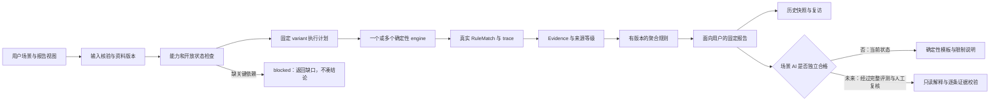

# Scenario Engine：执行与报告契约设计

这是拟实现的服务契约；本阶段仅注册设计数据和可核样例，**没有新增 HTTP 路由或运行调度器**。



梦境单独进入 `validated_dream_corpus → scoped RAG → Evidence → cultural_report → qualified AI`，不调用确定性排盘器，不输出 `deterministic=true`。没有语料或模型资格时返回 blocked，不套用出生资料或奇门盘制造结果。

## 注册表与执行计划

`config/scenarios/registry.json` 固定十个 scenario_id、十一 entry_id；每条记录输入、依赖、准确 variant、真实结构 rule IDs、审计 Evidence 指针、当前成熟度、开放状态、模板、缺口和历史键。**现有结构规则与 scenario_rules 分列**：后者目前全为空，避免把安星/纳甲称作桃花/财运判读规则。缺失八字 variant 为 null，不编造版本号或规则 ID。

运行器未来按 registry_version 锁定计划，读取实时 capabilities 与审核版本；客户端只传场景/视图/资料引用，不传 provider URL、密钥、规则列表或放开状态。required 依赖缺失阻止完整报告；supporting/conditional 只能产生明确标记的有限模块，不能悄悄从“八字＋紫微完整报告”降级为单星曜报告。切换方法需用户确认，并产生新的 plan_id；无 fallback 串派。

一事占问推荐策略 `method-routing-v1` **尚未实现**：有完整六次投掷→推荐六爻；没有投掷但有明确占时→建议时盘并说明仅有结构；两者都缺→补资料。推荐理由是输入可用性，不是预言准确率。周易可作为结构阅读层，六壬留在专业入口，不默认凑第三份旁证。刷新不得重起一卦；没有投掷值不得用随机数补齐。

事业财运的奇门分支只有用户另起具体事项时成立；占时不能冒充出生时刻。人生的风水分支仅用户提供明确方向时计算 `compass`，不得用出生资料“推”住宅朝向。个人出生年/月/日与请求时钟完全分离。

## 聚合不是拼规则列表

报告顺序为“本次能回答什么 → 当前主题/趋势 → 关键时间 → 支持因素 → 风险/限制 → 依据 → 尚未知”。规划中的综合指数只作为一类模块，当前 value=null，UI 显示“暂无可核指数”。

```json
{
  "scenario_id": "romance",
  "registry_version": "scenario-design-v1",
  "view": "default",
  "status": "blocked",
  "comprehensive_index": {"value": null, "policy_id": null, "reason": "未核评分策略"},
  "current_trend": {"value": null, "status": "unavailable"},
  "key_times": {"items": [], "status": "unavailable"},
  "favorable_factors": {"items": [], "status": "unavailable"},
  "risk_reminders": {"items": ["缺少桃花时序/判读规则，不能生成概率或遇见日期"]},
  "classical_basis": {"items": [], "status": "unavailable"},
  "uncertainty": {"items": ["八字引擎未注册"]},
  "ai": {"status": "disabled", "explanation": null}
}
```

每个未来聚合 claim 必须绑定 `engine_run_id + fact_ref + rule_match_id + evidence_ids + aggregation_rule_id + variant + grade + uncertainty_refs`。无法绑定则不能出现在有利因素/趋势/时间结论。描述型结构事实与判读结论分开：星在某宫≠某事有利；本变卦≠合作成功；节气边界≠幸运日。采用 schema 验证、事实逐字段绑定和 deterministic 模板，模板不产生新的吉凶推论。

跨引擎保留各自 variant、输入、事实和证据等级；不把宫位/十神/门星硬塞同一量纲，不多数投票，不因两个引擎共享同一本材料就算独立印证。冲突保留列表，受影响模块 unavailable/research；不冲突的已核结构可留在部分报告。来源等级不会高于支撑该条结论的已审核等级，D 保持命名软件约定。未来指数若有版本化因子、归一化、权重依据和反例，才可作为传统文化参考显示，并同时展示缺失覆盖，不包装为成功概率。

`key_times` 每条记录 start/end_exclusive、timezone、precision、calendar_boundary_policy、rule/evidence。有精确节气时间只表示计算边界，不能自动改成吉凶时间；只有流年证据不输出具体日期或时分。

## 历史和复访结构

拟建 `birth_profiles`、`scenario_requests`、`engine_runs`、`scenario_reports`、`report_revisions`、`revisit_entries`、`review_records`，当前均未建表/未开放接口。profile 保存 owner、version、国内时刻、time_precision、历法/年界/日界口径与有效状态；报告只存资料版本引用，不把出生资料复制到 analytics。默认不在浏览器存个人资料，服务端保存需用户选择。

周期键：`owner_id + scenario_id + view + ordered_profile_versions + civil_period_start/end_exclusive + registry/engine/rule/template/aggregation_versions + input_digest`。同资料版本同周期重复请求复用同一完成报告，不刷新重算以制造新运势；未完成计算幂等重试。缓存必须含 owner，合盘含双方版本/同意范围，不能跨用户泄漏。question/dream 的内容使用服务端加盐摘要，不能记录明文到运行日志。

日：北京时间 00:00～下一日；周：ISO 周一～下一周一；月：公历月第一天～下一月第一天；年：公历阅读年份。**这是阅读/缓存窗口，不是命理干支年/月界**。计算按锁定节气/立春等 variant 切分，与显示窗口并存。每个切分段都有原因和精度；周/月报告从真实因子事件聚合，不平均假分数。

`revisit_entries` 记录 optional 自填感受、事项进展、关注点、报告修订引用、创建时间；用户主观反馈不能作为“预测已准确”的标签或自动训练证据。资料修改/规则升级生成新 revision，旧报告不可回写冒充当时结果；对比页先确认口径一致再展示变化。提醒功能未来 opt-in，不默认推送。用户可撤回保存/删除个人原文，审计保留非个人版本哈希；权限服务未实现前不接入真实资料。

## 双人合盘

请求使用 participants.a / participants.b，各有 profile_id/version、资料精度、同意范围；不用“男方/女方”默认限制关系。引擎如传统起运必须要求性别口径，缺少时该运期模块不可用。先分别运行八字和可用紫微，之后独立 pair-rule processor 检查成对条件；两张盘并排不等于合盘已实现。

比较结果每维为 `{a_fact_ref, b_fact_ref, relation, symmetry, direction, rule_ids, evidence_ids, status, reason}`。对称关系 A/B 互换一致，方向关系必须说明主客，不能把“对方影响我”互换成“我影响对方”。某人缺时辰/依赖失效时只保留不受影响的对比；当前全成对维度 unavailable、score=null。旧 baseline=60 的评分表不接入。

## API 和后台边界

保留已有 `/api/v1/execute`；未来考虑 `GET /api/v1/scenarios`、`POST /api/v1/scenarios/execute`、`GET /api/v1/scenario-reports/{id}`、`POST /api/v1/scenario-reports/{id}/revisit`。它们是**拟议接口**，当前不存在，不让原型请求这些 URL。响应区分 blocked / partial / completed、每模块 unavailable / computed / conditional / research / conflict，服务端只向客户端返回必要原典片段。

场景 AI 不复用 `ExplanationService` 的单域回复 schema 假装支持多域：需要专门 aggregation-context schema，把聚合已核事实、模块空值、证据、不可解释项作为只读上下文。AI 不改 chart/score/时间，不补缺值，不访问未经审核的 raw/quarantine；无质量资格前完全不调用 provider。未来资格绑定 scenario+view+model+prompt+variant+registry+rule版本，覆盖缺八字、错误时间、双人互换、引文伪造、跨域冲突、漏限制及梦境 RAG 注入，另有真实人工语义复核。失败降级模板，决不将 AI 补词当成计算已成功。
